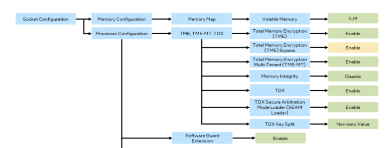
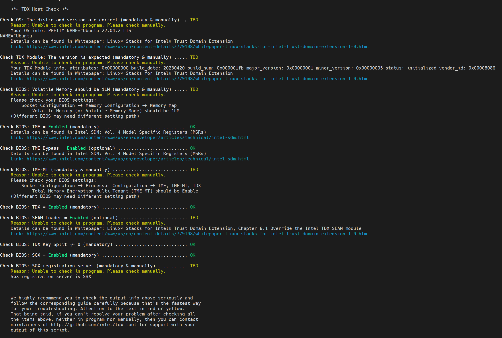

# EMR platform configuration guide

This guide introduces how to enable RA on the Intel EMR platforms.

## BMRA configuration
### QAT Driver
Download the EMR QAT driver package and put it in the folder ``/tmp/nda_qat/`` on the ansible host machine. Then configure the QAT related operations in the ``group_vars`` and ``host_vars`` files referring to the security session in the below url
<https://networkbuilders.intel.com/solutionslibrary/network-and-edge-reference-system-architectures-portfolio-user-manual> 

### DPDK driver
To align with EMR BKC ingredient version, on the EMR platform we will use ```DPDK 22.11.1``` lts version.

### TDX driver

***Note: Only Ubuntu 22.04 is enabled for Intel TDX in RA***

Intel TDX(Trusted Domain Extensions) can deploy hardaware-isolated virtual machines called trusted domains(TDs). Detailed infor can be found [here](https://www.intel.com/content/www/us/en/developer/articles/technical/intel-trust-domain-extensions.html).


To install the TDX, you should enabled the ``configure_tdx`` in the ``host_vars/<host-name>.yml`` for BMRA. Then follow the [readme](https://github.com/intel-innersource/containers.orchestrators.kubernetes.container-experience-kits#readme) to deploy the RA cluster.

After the installation, then you need to configure the bios following the guide below to enabled the tdx and install the msr tools via command.

***Note: TDX BIOS configuration can only be opened w/ TDX kernel, otherwise it will cause boot failure.***

```
apt install msr-tools
```
.

After the bios is correctly configured, then you can run /opt/cek/tdx-tools/utils/check-tdx-host.sh on the host. Then the following output should be get:



## TDVM configuration
### Host environemt preparation

For TDVM enabling, TDX kernel should be installed first on the host to make sure that the TDX can be successfully configured. You can use the RA existing role ``bootstrap/install_tdx_drivers`` to install the kernel first following the below guide.

git clone https://github.com/intel-innersource/containers.orchestrators.kubernetes.container-experience-kits#readme cek

```
cd <cek_folder>
make vm-profile PROFILE=$profile ARCH=$arch

<fill the machine information in the generated inventory.ini file>

ansible-playbook -i inventory.ini playbooks/intel/tdx.yml

<reboot the machine and enable tdx in the bios>

```


After the installation is done, follow the guide in the ``TDX driver`` session above to configure the bios correctly. After it is correctly configured, you can obeserve below info via dmesg:
```
dmesg |grep -i tdx


[    0.000000] Linux version 6.2.16-mvp30v3+7-generic(gcc (Ubuntu 11.4.0-1ubuntu1~22.04) 11.4.0, GNU ld (GNU Binutils for Ubuntu) 2.38) #mvp30v3+tdx SMP PREEMPT_DYNAMIC Wed Sep  6 11:29:15 CEST 2023
[    1.126416] tdx: BIOS enabled: private KeyID range [64, 128)
[   14.295018] KVM-debug: PASS: single step TDX module emulated CPUID 0
[   14.295018] KVM-debug: PASS: single step TDX module emulated RDMSR 0x1a0
[   38.271537] tdx: SEAMCALL failed: leaf 254, error 0xc000050500000000.
[   38.271929] tdx: TDDEBUGCONFIG isn't supported.
[   38.296005] tdx: TDX module: atributes 0x0, vendor_id 0x8086, major_version 1, minor_version 5, build_date 20230420, build_num 507
[   38.296014] tdx: TDX module: features0: fbf
[   39.228648] tdx: 262659 pages allocated for PAMT.
[   39.228656] tdx: TDX module initialized.
[   39.228667] kvm_intel: tdx: max servtds supported per user TD is 1
[   39.228676] kvm_intel: tdx: live migration supported
[   39.228677] kvm_intel: TDX is supported.
```

### VMRA deployment with TDVM

Follow the [readme](https://github.com/intel-innersource/containers.orchestrators.kubernetes.container-experience-kits#readme) to prepare the installation envrionmemt. Then run the command
```
make vm-profile PROFILE=on_prem ARCH=emr

```

Then change the ``configure_tdx`` to ``true`` int the ``host_vars/<vm_host>.yml`` and ``host_vars/<vm>.yml``, then run the command to deploy the vmra cluster

For tdx 1.5/1.0 version, it doest not allow pci passthrough into vms due to security consideration, so DO NOT enable the pci passthrough in the host_vars/<vm_host>.yml and dataplane interfaces/qat_devices in host_vars/<vm>.yml.

Below shows the snippet code for vm_host and vm configuration for tdvm.

Snippet code for pci passthrough configuration in ``host_vars/<vm_host>.yml``:
```
vms:
    (...)
#    pci:
#      - "18:02.2"       # 18:xx.x are example VFs for networking
#      - "18:02.3"
#      - "18:02.4"
#      - "18:02.5"
#      - "3d:01.1"       # 3x:xx.x are example VFs for QAT
#      - "3f:01.1"
```

Snippet code for dataplane_interfaces and qat_devices in ``host_vars/<vm>.yml``:

```
# dataplane interface configuration list
dataplane_interfaces: []
#dataplane_interfaces:
#  - bus_info: "06:00.0"            # PCI bus info
#    pf_driver: iavf                # Driver inside VM
#    sriov_numvfs: 0
#    default_vf_driver: "igb_uio"
#  - bus_info: "07:00.0"
#    pf_driver: iavf
#    sriov_numvfs: 0
#    default_vf_driver: "iavf"
#  - bus_info: "08:00.0"
#    pf_driver: iavf
#    sriov_numvfs: 0
#    default_vf_driver: "iavf"
#  - bus_info: "09:00.0"
#    pf_driver: iavf
#    sriov_numvfs: 0
#    default_vf_driver: "igb_uio"

(...)

# QAT interface configuration list
qat_devices: []
#qat_devices:
#  - qat_id: "0000:0a:00.0"
#    qat_sriov_numvfs: 0                # Has to be set to 0 here to not create any VFs inside VM.

#  - qat_id: "0000:0b:00.0"
#    qat_sriov_numvfs: 0                # Has to be set to 0 here to not create any VFs inside VM.
```

```
ansible-playbook -i inventory.ini playbook/vm.yml
```


## Generic VMRA configuration
No special configuration for EMR, please refer the [VMRA guide](https://networkbuilders.intel.com/solutionslibrary/network-and-edge-virtual-machine-reference-system-architecture-user-guide) for deployment.

## Cloud RA configuration
Not supported yet, to be done.
